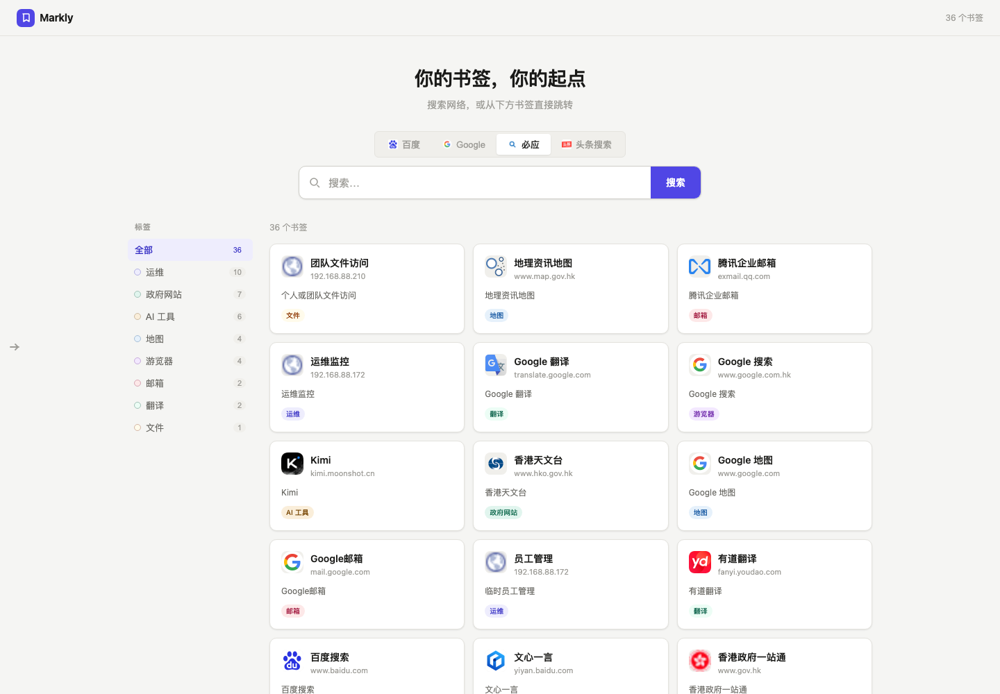
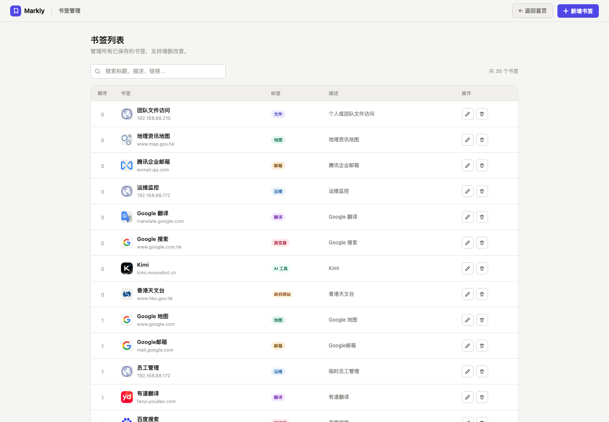

# Markly

个人书签与搜索中心 —— 一个轻量的自托管书签管理服务，支持标签分类、多引擎搜索跳转和可视化管理后台。

## 截图

### 首页



首页提供搜索引擎快捷切换（百度 / Google / 必应 / 头条搜索）、按标签筛选书签，以及关键词搜索。

### 管理后台 `/admin`



管理后台以表格形式展示全部书签，支持新增、编辑、删除，以及标题、描述、链接的关键词搜索。

## 技术栈

- [FastAPI](https://fastapi.tiangolo.com/) + [SQLModel](https://sqlmodel.tiangolo.com/)（SQLite 存储）
- Jinja2 模板 + 原生 JS/CSS（无前端构建步骤）
- [uv](https://docs.astral.sh/uv/) 管理 Python 依赖

## 快速开始

```bash
make install   # uv sync 安装依赖
make dev       # 启动开发服务器（http://127.0.0.1:8001，热重载）
```

访问 `/` 使用首页，访问 `/admin` 管理书签。

也可以通过 Docker 运行：

```bash
make docker-build
make docker-up
```

`docker-compose.yml` 默认将服务映射到宿主机的 `8001` 端口，并将数据库文件持久化到 `markly_data` 数据卷。

## 配置

通过环境变量（或 `.env` 文件）配置：

| 变量        | 默认值                     | 说明                 |
| ----------- | -------------------------- | -------------------- |
| `DB_PATH`   | `sqlite:///data/markly.db` | 数据库连接字符串      |
| `DB_ECHO`   | `false`                    | 是否打印 SQL 执行日志 |

## API 端点

### 页面

| 方法 | 路径     | 说明                 |
| ---- | -------- | -------------------- |
| GET  | `/`      | 首页（书签展示与搜索）|
| GET  | `/admin` | 书签管理后台          |

### 书签接口

| 方法   | 路径                     | 说明                                                                 |
| ------ | ------------------------ | ---------------------------------------------------------------------- |
| GET    | `/api/bookmarks`         | 获取书签列表，支持查询参数 `tag`（按标签筛选）、`q`（按标题/描述/链接模糊搜索） |
| GET    | `/api/bookmarks/{id}`    | 获取单个书签详情                                                        |
| POST   | `/api/bookmarks`         | 新增书签                                                                |
| PUT    | `/api/bookmarks/{id}`    | 更新书签（部分字段）                                                    |
| DELETE | `/api/bookmarks/{id}`    | 删除书签                                                                |

书签字段：`title`（标题）、`url`（链接）、`description`（描述）、`tags`（标签列表）、`icon`（自定义图标 URL，留空自动使用 favicon）、`order`（显示顺序，数字越小越靠前）。

## CI/CD

`.github/workflows/docker-publish.yml` 在每次推送到 `main` 分支时自动构建 Docker 镜像，并推送到阿里云容器镜像服务 `registry.cn-hangzhou.aliyuncs.com/allen2fuc/markly`（标签为 `latest` 与提交短哈希）。使用前需要在仓库 Secrets 中配置 `ACR_USERNAME` 与 `ACR_PASSWORD`。
